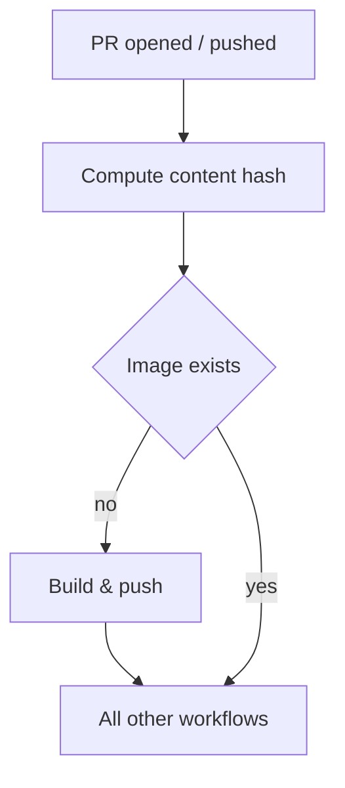

> How I cut our GitHub Actions pipeline from 20 minutes to under 10


*Photo by [Kenny Eliason](https://unsplash.com/@heyquilia?utm_source=Obsidian%20Image%20Inserter%20Plugin&utm_medium=referral) on [Unsplash](https://unsplash.com/?utm_source=Obsidian%20Image%20Inserter%20Plugin&utm_medium=referral)*


## Problem

Our CI pipeline was taking 20 minutes on average and it wasn't even reliable. Tools installation would occasionally fail due to network issues or rate limits, causing workflows to fail for reasons completely unrelated to the code itself.
The project is a medium-complexity Go codebase with a few microservices. Build and unit tests were fast. Most of the time was consumed by installing various binary tools on every single run and since these installations depended on external networks, they were a constant source of flakiness.

## What I Tried First

My first assumption was that the Kubernetes cluster setup was the bottleneck, since we use [kind](https://kind.sigs.k8s.io/) to run dependencies like PostgreSQL and NATS. I replaced kind with [k3s](https://k3s.io/). It saved 1–2 minutes, but nothing significant.

Fortunately, our platform engineers had been recording per-step timing via OpenTelemetry. Looking at the data, the bootstrap step (cluster creation, pod startup, building services, running tests) was the heaviest but also the hardest to improve. The second biggest cost was tool installation, repeated on every single run. That was the real target.

## Solution

The fix was straightforward in principle: build a Docker image with all tools pre-installed, host it on GitHub Container Registry, and run all workflows inside that image.



In practice, I added two new workflows:

- **resolve-image** computes a hash of the files the base image Dockerfile depends on, checks if an image with that hash tag already exists in the registry, and outputs the result.
- **build-image** builds and pushes the base image with that hash tag, only triggered when resolve-image reports the image doesn't exist yet.

The hash is computed from three files: the Dockerfile itself, `go.mod`, and `go.sum`. If none of these change, the tag is identical and the build is skipped entirely.

```YAML
- name: Compute content hash
  id: hash
  run: |
    HASH=$(cat \
      Dockerfile \
      go.mod \
      go.sum \
      | sha256sum | cut -d' ' -f1 | head -c 16)
    echo "tag=sha-${HASH}" >> "$GITHUB_OUTPUT"
```

All other workflows first run resolve-image. If the image already exists, build-image is skipped and every subsequent job runs on the existing image immediately. If not, build-image runs first, then the rest follow.

```YAML
# In resolve-image: check whether the image already exists
- name: Check if image exists in GHCR
  id: check
  run: |
    if docker manifest inspect ghcr.io/acme/base:${{ steps.hash.outputs.tag }} \
      > /dev/null 2>&1; then
      echo "exists=true" >> "$GITHUB_OUTPUT"
    else
      echo "exists=false" >> "$GITHUB_OUTPUT"
    fi

# In build-image: skip the build if the image already exists
- name: Build and push ci-base image
  if: needs.resolve-image.outputs.exists != 'true'
  uses: docker/build-push-action@v7
  with:
    context: .
    file: Dockerfile
    push: true
    tags: ghcr.io/acme/base:${{ needs.resolve-image.outputs.tag }}
```

## Result

Building the base image takes around 10 minutes but in practice, most PRs never trigger a rebuild. Thanks to [Renovatebot](https://github.com/renovatebot/renovate) handling automatic dependency updates, base image builds happen almost exclusively on Renovatebot PRs (Go version upgrades, tool version bumps, etc.). PRs created by humans almost always skip the build entirely and go straight to running on the existing image.

Faster feedback loops have a compounding effect on developer experience. Engineers spend less time waiting and more time iterating. Since merging this change, flaky failures from tool installation have essentially disappeared.

One unexpected benefit: since the base image already has all the tools pre-installed, it doubles as a foundation for our Codespaces development environment. Developers get the same tool versions locally as they do in CI, no more "works on my machine" surprises. I'll cover that setup in the next post.

After that, there's still one more thing worth revisiting: replacing kind with k3s in both CI and Codespaces. It didn't make a significant difference on its own, but combined with the base image and Codespaces prebuilds, the numbers might tell a different story.

**This is part 1 of a 3-part series:**

- **Faster CI with a base Docker image** ← you are here
- Reusing the CI base image in Codespaces
- Replacing kind with k3s in CI and Codespaces